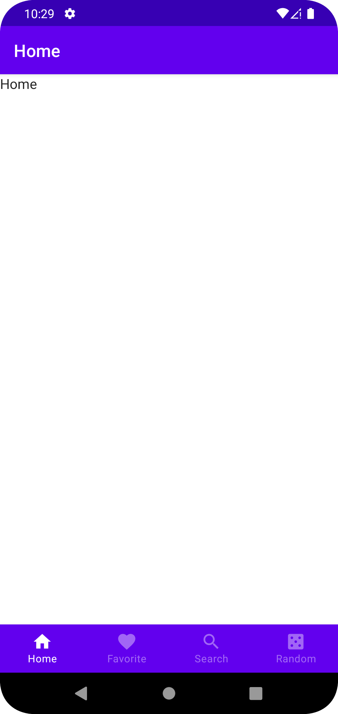

# Bottom Navigation

Jetpack Compose Bottom Navigation

## Preview



## Tests

```kotlin
class MainNavHostTest {
    @get:Rule
    val composeTestRule = createComposeRule()
    lateinit var navController: NavHostController

    @Before
    fun setupMainNavHost() {
        composeTestRule.setContent {
            navController = rememberNavController()
            MainNavHost(navController = navController)
        }
    }

    @Test
    fun mainNavHost() {
        // Test that home screen is displayed
        composeTestRule.onNodeWithContentDescription("Home Screen").assertIsDisplayed()
    }
}
```